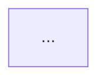

Dựng `FLOW.md` — sơ đồ Mermaid luồng xử lý bên trong service này.

Khác với `SERVICE_MAP.md` (chỉ mô tả bề mặt bên ngoài: gọi ra / expose / publish / consume),
`FLOW.md` mô tả LUỒNG XỬ LÝ BÊN TRONG — từ điểm nhận vào, qua các bước xử lý chính, tới nơi
lưu trữ và đầu ra. Đây là suy luận sâu hơn từ code thực tế, không chỉ chép lại
`SERVICE_MAP.md`, nhưng phần biên (Kafka/RabbitMQ/REST/WebSocket vào-ra) phải khớp với file đó.

## Trước khi dựng
1. Đọc `SERVICE_MAP.md` hiện có. Nếu phần biên (message queue in/out, REST expose/gọi ra,
   WebSocket) trong sơ đồ sắp vẽ không khớp với file đó, dừng lại — báo cho người dùng, đừng
   tự chọn một bên.
2. Nếu chưa rõ service này có luồng xử lý đủ phức tạp để đáng vẽ hay không (một CRUD service
   đơn giản có thể không cần), hỏi người dùng xác nhận trước khi quét sâu.

## Các bước khảo sát
1. **Điểm nhận vào**: `@MessagePattern`/`@EventPattern` (`@nestjs/microservices` — Kafka/
   RabbitMQ), REST controller, `@WebSocketGateway`/`@SubscribeMessage`, cron
   (`@nestjs/schedule` — `@Cron`), Bull/BullMQ processor (`@Process`).
2. **Chuỗi xử lý nội bộ**: theo từng entry point, lần theo các service/provider chính mà nó
   gọi — chỉ liệt kê bước có ý nghĩa kiến trúc (validate → transform → gọi service khác →
   gửi đi...), không liệt kê mọi method.
3. **Tầng lưu trữ**: TypeORM entity/repository, Redis (ioredis, cache module), Bull/BullMQ
   queue (Redis-backed), và quan hệ giữa chúng nếu có.
4. **API/endpoint quản trị**: REST controller (nhóm theo mục đích: nghiệp vụ, vận hành/ops,
   health-check), health module (`@nestjs/terminus`), Swagger nếu có.
5. **Đầu ra**: Kafka/RabbitMQ producer (`ClientProxy.emit/.send`), REST client gọi ra
   (`HttpService`), WebSocket emit, ghi DB — đối chiếu với "Gọi ra"/"Publish" trong
   `SERVICE_MAP.md`.
6. **Phụ thuộc hạ tầng chỉ lúc khởi động** (Config Server, service discovery...) — vẽ riêng,
   ghi rõ "chỉ bootstrap/deploy", không lẫn vào luồng runtime chính.

## Dựng Mermaid
`flowchart LR`, dùng `subgraph` để nhóm: nguồn bên ngoài → message queue/input bên ngoài →
**service này** (subgraph riêng, `direction TB`, lồng thêm subgraph con cho tầng storage/
API/admin nếu đủ phức tạp để tách) → message queue/output bên ngoài → hệ thống downstream.
Mũi tên liền cho luồng xử lý tuần tự chính; mũi tên chấm `-.->` cho quan hệ phụ/không đồng
bộ/chỉ để tra cứu (không phải bước xử lý tuần tự).

## Ghi file
Ghi/thay toàn bộ `FLOW.md` ở root repo theo đúng khuôn sau (tên service lấy từ `CLAUDE.md`
hoặc `package.json`, không hỏi lại nếu đã biết):

```markdown
# Sơ đồ luồng tổng quan — <tên service>

> Mở file này trên GitLab hoặc VS Code (extension "Markdown Preview Mermaid Support") để xem dạng hình vẽ.
> Nguồn dữ liệu: suy luận từ code, đã xác nhận qua skill `update-service-map` — xem `SERVICE_MAP.md`.



## Ghi chú
- ...
```

Trình bày lại sơ đồ trong câu trả lời để người dùng xem ngay, kèm danh sách phần nào còn
chưa chắc chắn (suy luận yếu, cần người xác nhận) trong mục "Ghi chú".

## Không làm
- Không tự vẽ luồng suy đoán khi không thấy bằng chứng trong code — ghi "chưa rõ" thay vì bịa.
- Không sửa code, không sửa `SERVICE_MAP.md` trong command này — chỉ đọc và tạo/ghi `FLOW.md`.
- Không để phần biên (message queue in/out, REST, WebSocket) của sơ đồ trái với
  `SERVICE_MAP.md` mà không báo.
